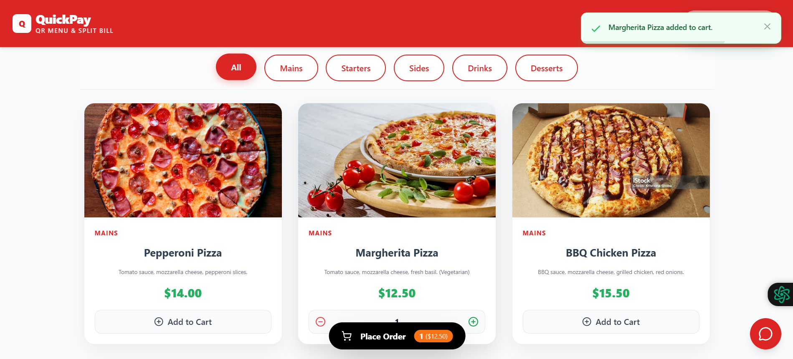
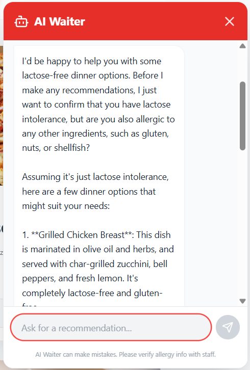
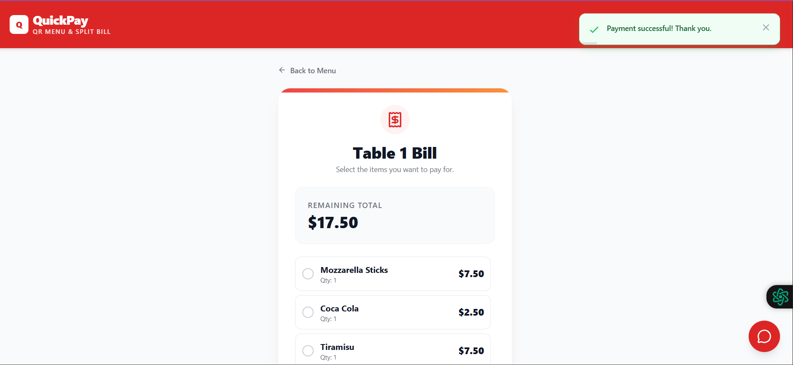
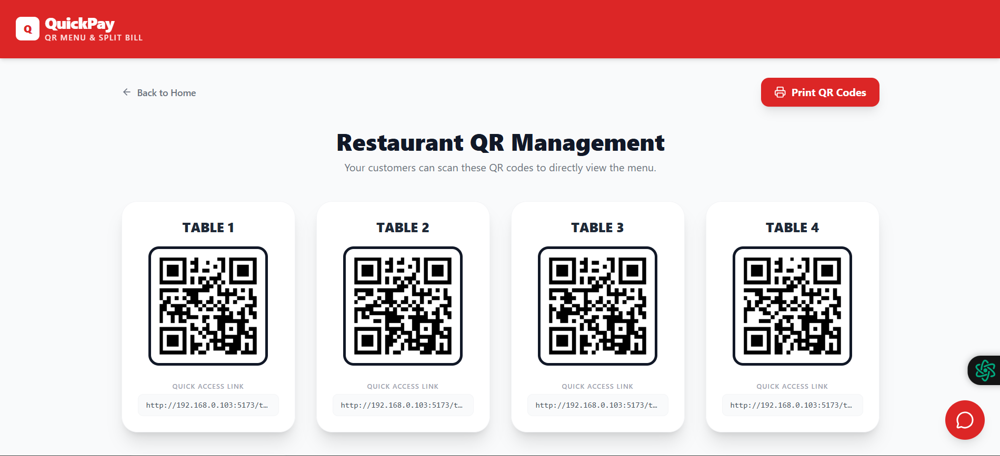

# 💳 QuickPay: AI-Powered Smart QR Menu System

**Course:** SWE314 - Web Programming  
**University:** İstinye University  
**Student:** Asiye Nur Aslan (220911809)  
**Role:** Business Logic & API Integration Specialist (Student B) & DevOps Lead  

---

## 📸 Project Screenshots

### 📱 Digital Menu & AI Waiter

| Digital Menu (QR Entry) | AI Waiter Support |
|------------------------|------------------|
|  |  |
| *Mobile-responsive table access* | *LLM-powered dish suggestions* |

---

### 💳 Payment & Admin Panel

| Split Bill & Checkout | Admin Dashboard |
|----------------------|-----------------|
|  |  |
| *Dynamic debt calculation logic* | *Real-time table status tracking* |

---

### 📱 Mobile Experience

| Mobile Interface 1 | Mobile Interface 2 |
|------------------|-------------------|
| .jpeg) | .jpeg) |
| *Responsive Design* | *Payment Integration* |

---

## 🚀 Key Features & Technical Depth

- 📱 **QR-Based Routing:** `react-router-dom` ile masa bazlı dinamik yönlendirme (`/table/:id`)
- 🤖 **AI Integration:** Groq (Llama-3) API ile akıllı AI garson sistemi
- 🧾 **Split-Bill Logic:** Grup yemekleri için backend tabanlı hesap bölüştürme algoritması
- 🛡️ **Code Robustness:** Pydantic ile güçlü veri doğrulama
- 📱 **Mobile-First Design:** Tailwind CSS ile tamamen responsive yapı

---

## 🏗️ System Architecture

- **Frontend:** React + Vite (Hooks ile state yönetimi)
- **Backend:** FastAPI (Async Python)
- **ORM:** SQLModel
- **Database:** SQLite
- **API:** RESTful Architecture

---

## 🔧 Installation & Setup

### 1️⃣ Backend Setup

```bash
cd backend
python -m venv venv

# Windows
venv\Scripts\activate

# Mac/Linux
source venv/bin/activate

pip install -r requirements.txt
uvicorn main:app --reload
```
### 2️⃣ Frontend Setup

```bash
cd frontend
npm install
npm run dev
```
### 3️⃣ Database & Seeding

```bash
python seed.py
```

### 👥 Contributors
- Asiye Nur Aslan – Business Logic & DevOps Lead
- Melis Kahraman – Frontend Lead
- Azize Altınel – UI/UX Designer & Frontend Developer
- Yade Başkan – Backend & Database Architect
- Youssef Ayyash – Full Stack Integration & DevOpsS

This project was developed for the SWE314 - Web Programming course at Istinye University.