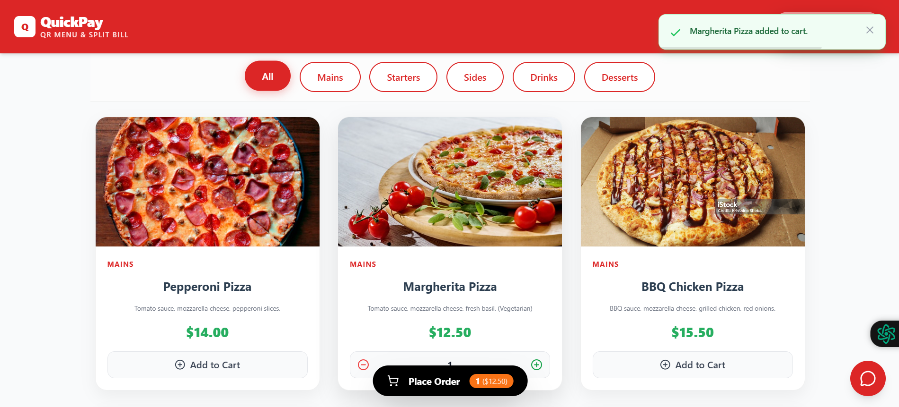
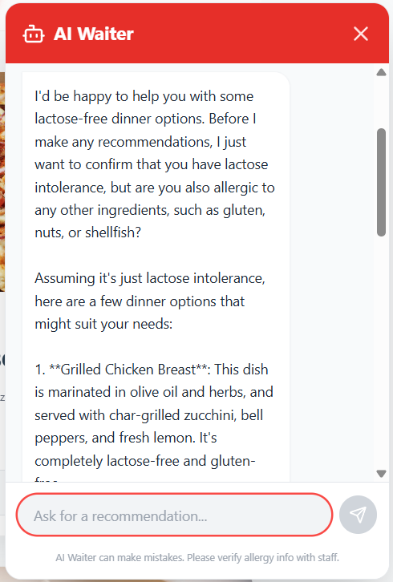
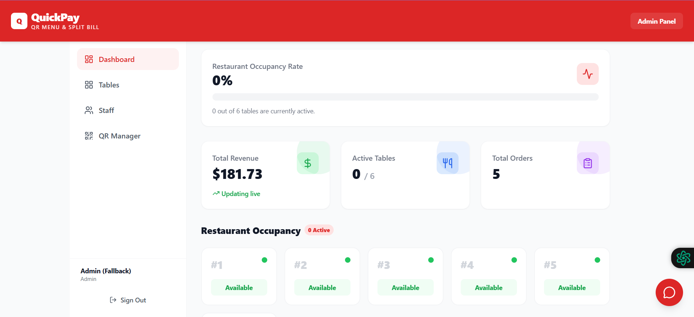

# 💳 QuickPay: AI-Powered Smart QR Menu System

**Course:** SWE314 - Web Programming  
**University:** İstinye University  

🚀 **Live Demo:** [https://swe-314-web-programming-project.vercel.app/](https://swe-314-web-programming-project.vercel.app/)

---

## 📸 Project Screenshots

### 📱 Digital Menu & AI Waiter

| Digital Menu (QR Entry) | AI Waiter Support |
|------------------------|------------------|
|  |  |
| *Mobile-responsive table access* | *LLM-powered dish suggestions* |

---

### 💳 Payment & Admin Panel

| Split Bill & Checkout | Admin Dashboard |
|----------------------|-----------------|
|  |  |
| *Dynamic debt calculation logic* | *Real-time table status tracking* |

---

### 📱 Mobile Experience

| Mobile Interface 1 | Mobile Interface 2 |
|------------------|-------------------|
| .jpeg) | .jpeg) |
| *Responsive Design* | *Payment Integration* |

---

## 🚀 Key Features & Technical Depth

- 📱 **QR-Based Routing:** Table-based dynamic routing with `react-router-dom` (`/table/:id`)
- 🤖 **AI Integration:** Intelligent AI waiter system with Groq (Llama-3) API
- 🧾 **Split-Bill Logic:** Backend-based bill splitting algorithm for group meals
- 🛡️ **Code Robustness:** Strong data validation with Pydantic
- 📱 **Mobile-First Design:** Fully responsive structure with Tailwind CSS

---

## 🏗️ System Architecture

- **Frontend:** React + Vite (State management with Hooks)
- **Backend:** FastAPI (Async Python)
- **ORM:** SQLModel
- **Database:** PostgreSQL (on Railway)
- **API:** RESTful Architecture

---

## 🧪 Testing & Automation (Playwright)

- **E2E Test Scenario:** Added a simple Playwright test in the frontend folder. For example: User scans QR to enter table, selects "Beef Burger", and verifies cart updates.
- **Visual Regression:** Implemented snapshot testing to check if the mobile view is broken (screen comparison).
- **Report Addition:** "I implemented Playwright for End-to-End (E2E) testing to ensure that the critical user path—from scanning the QR code to checkout—remains bug-free after every code change."

---

## 🚀 Deployment & CI/CD

- **Vercel/Railway:** Frontend deployed on Vercel, backend on Railway (free tier).
- **CI/CD Pipeline:** Added `.github/workflows/main.yml` to the GitHub repo. Tests run automatically on every push, aligning with the "DevOps Lead" role.
- **Database Migration:** Migrated from SQLite to PostgreSQL on Railway, fully meeting this week's curriculum.

---

## 🛡️ Security & Cybersecurity

- **Rate Limiting:** Added `slowapi` library to FastAPI to prevent users from spamming the AI Waiter (e.g., 100 questions per second exhausting the quota).
- **OWASP Top 10 Audit:** "I sanitized all inputs to prevent SQL Injection and managed API keys via .env files to prevent credential leakage."
- **Rate Limit Example:** 
  ```python
  # Rate limiting logic to prevent API abuse
  @app.get("/ai-chat")
  @limiter.limit("5/minute")
  async def chat_with_ai(request: Request, message: str):
      return await ai_service.get_response(message)
  ```

---

### 1️⃣ Backend Setup

```bash
cd backend
python -m venv venv

# Windows
venv\Scripts\activate

# Mac/Linux
source venv/bin/activate

pip install -r requirements.txt
uvicorn main:app --reload
```
### 2️⃣ Frontend Setup

The frontend is deployed on Vercel at [https://swe-314-web-programming-project.vercel.app/](https://swe-314-web-programming-project.vercel.app/). For local development:

```bash
cd frontend
npm install
npm run dev
```
### 3️⃣ Database & Seeding

```bash
python seed.py
```

### 👥 Contributors
- Asiye Nur Aslan – Business Logic & DevOps Lead
- Melis Kahraman – Frontend Lead
- Azize Altınel – UI/UX Designer & Frontend Developer
- Yade Başkan – Backend & Database Architect
- Youssef Ayyash – Full Stack Integration & DevOps

This project was developed for the SWE314 - Web Programming course at Istinye University.